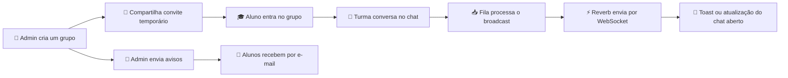

<div align="center">

# 💬 Sinaliza - Chat Aviso

### Grupos, conversas e avisos importantes em um só lugar


<br />

[](https://laravel.com)
[](https://vuejs.org)
[](https://inertiajs.com)
[](https://primevue.org)
[](https://laravel.com/docs/reverb)

[](https://tailwindcss.com)
[](https://www.typescriptlang.org)
[](https://vite.dev)
[](https://pestphp.com)
[](https://www.docker.com)
[](https://www.postgresql.org)
[](https://redis.io)
[](https://pm2.keymetrics.io)


</div>

---

## 🌟 Sobre o projeto

O **Chat Aviso** é uma plataforma simples, bonita e responsiva para organizar a comunicação entre administradores e alunos.

Crie grupos, converse pelo chat, envie avisos por e-mail, compartilhe links temporários e deixe cada usuário escolher seu próprio emoji de perfil.

Ideal para:

- 🎓 Escolas, cursos e turmas
- 🧑‍🏫 Professores e instrutores
- 👥 Comunidades e equipes
- 🏢 Grupos internos e treinamentos
- 🚀 Qualquer projeto que precise de comunicação organizada

> [!NOTE]
> O projeto está em **melhoria contínua**. Novas funcionalidades, ajustes visuais e melhorias técnicas podem ser adicionados com o tempo.

## ✨ Funcionalidades

<table>
<tr>
<td width="50%" valign="top">

### 👑 Administradores

- ✅ Criar, editar e excluir grupos
- 👥 Adicionar e remover alunos
- 🔗 Gerar links temporários de convite
- ⏳ Escolher a validade dos links
- 🚫 Revogar convites ativos
- 💬 Participar dos chats
- ⚡ Receber mensagens em tempo real
- 🔔 Ver notificações de novos chats
- 📧 Enviar avisos por e-mail
- 🛡️ Gerenciar somente os próprios grupos

</td>
<td width="50%" valign="top">

### 🎓 Alunos

- 👀 Visualizar somente seus grupos
- 🔗 Entrar por convite temporário
- 💬 Conversar com a turma
- ⚡ Receber mensagens em tempo real
- 🔔 Acompanhar mensagens e avisos não lidos pelo sininho
- 📢 Ler avisos importantes em modais sequenciais
- 😀 Escolher qualquer emoji como avatar
- 🔎 Pesquisar emojis por categoria
- 🎨 Alterar o perfil quando quiser
- 🔐 Acessar apenas grupos autorizados

</td>
</tr>
</table>

## 🎨 Interface com PrimeVue

O projeto utiliza **PrimeVue** para entregar componentes acessíveis, consistentes e agradáveis:

| Componente | Utilização |
| --- | --- |
| `Button` | Ações, navegação, envio e remoção |
| `Card` | Organização visual das páginas e grupos |
| `DataTable` e `Column` | Listagem de participantes |
| `Select` | Seleção de alunos e duração dos convites |
| `InputText` | Campos e links compartilháveis |
| `Textarea` | Mensagens do chat e avisos |
| `Message` | Alertas e informações importantes |
| `Popover` | Seletor completo de emojis |
| `Avatar` | Emojis dos participantes |
| `Toast` | Notificações em tempo real com grupo, remetente e resumo |
| `Popover` | Lista de mensagens e avisos não lidos no sininho |
| `Dialog` | Leitura obrigatória e sequencial dos avisos |
| `Tooltip` | Explicações rápidas das ações |

O seletor de avatar suporta **todos os emojis Unicode disponíveis no dispositivo**, incluindo busca, categorias, bandeiras, favoritos, tons de pele e emojis compostos. 🌈

## 🧰 Tecnologias utilizadas

| Camada | Tecnologia |
| --- | --- |
| Backend | Laravel 13 e PHP 8.3+ |
| Frontend | Vue 3 e TypeScript |
| Navegação SPA | Inertia.js 3 |
| Componentes | PrimeVue 4 |
| Estilização | Tailwind CSS 4 |
| Build | Vite 8 |
| Autenticação | Laravel Fortify |
| Banco padrão | SQLite |
| E-mails | API central de e-mail |
| Tempo real | Laravel Reverb, Laravel Echo e WebSockets |
| Broadcasting | Canais privados por usuário |
| Filas | Laravel Queue com Redis em produção |
| Stack Docker | Nginx, PHP-FPM, PM2, PostgreSQL e Redis |
| Testes | Pest |
| Qualidade | Laravel Pint, ESLint, Prettier e Vue TSC |

## 🧭 Como funciona



## 🚀 Instalação

### Requisitos

- PHP 8.3 ou superior
- Composer
- Node.js e npm

### Preparar o projeto

```bash
git clone <url-do-repositorio>
cd chat-aviso

composer install
npm install
```

### Configurar o ambiente

```bash
cp .env.example .env
php artisan key:generate
```

### Criar o banco e os dados de demonstração

```bash
php -r "file_exists('database/database.sqlite') || touch('database/database.sqlite');"
php artisan migrate --seed
```

### Iniciar o desenvolvimento

```bash
composer dev
```

O comando inicia o Laravel, o worker da fila, o servidor Reverb e o Vite juntos. Pronto! Abra o endereço configurado em `APP_URL`. 🎉

## 🐳 Docker e Portainer

O projeto inclui uma stack pronta para produção com:

- **Nginx + PHP-FPM** servindo o Laravel.
- **PM2 Runtime** supervisionando Nginx, PHP-FPM, workers da fila, scheduler e Reverb.
- **Laravel Reverb** atrás do mesmo domínio e porta da aplicação.
- **Redis** para filas, cache e sessões.
- **PostgreSQL 17** com volume persistente.
- Migrações, cache de produção e chaves internas preparados automaticamente ao iniciar.

### Deploy pelo link do Git no Portainer

1. Publique as alterações na branch `master` ou `main`. O GitHub Actions criará `ghcr.io/juancjc/chat-aviso:latest`.
2. Na primeira publicação, deixe o pacote `chat-aviso` público no GitHub Packages ou cadastre o GHCR como registry no Portainer.
3. No Portainer, abra **Stacks → Add stack → Git repository**.
4. Use o repositório `https://github.com/Juancjc/chat-aviso`.
5. Informe `docker-compose.yml` como caminho do Compose.
6. Configure pelo menos `APP_URL` e `DB_PASSWORD`. O arquivo [`portainer.env.example`](portainer.env.example) contém todas as opções recomendadas.
7. Clique em **Deploy the stack**.

A aplicação ficará disponível na porta `APP_PORT`, que por padrão é `8080`. Para HTTPS, aponte seu proxy reverso para essa porta e defina:

```env
APP_URL=https://chat.seudominio.com
SESSION_SECURE_COOKIE=true
```

O WebSocket usa automaticamente o mesmo domínio e protocolo aberto no navegador. O Nginx interno encaminha `/app` e `/apps` para o Reverb, portanto nenhuma porta pública adicional é necessária.

> [!IMPORTANT]
> A stack utiliza o volume `postgres_data`. Se uma versão anterior com MariaDB já possuir dados, faça a migração dos dados antes de remover o volume antigo; trocar a imagem do banco não converte os registros automaticamente.

### Construir localmente

```bash
docker compose -f docker-compose.yml -f docker-compose.build.yml up -d --build
```

### Processos gerenciados pelo PM2

```text
php-fpm    servidor PHP
nginx      servidor HTTP e proxy WebSocket
queue      workers Laravel configuráveis por QUEUE_WORKERS
scheduler  php artisan schedule:work
reverb     servidor WebSocket Laravel Reverb
```

Para inspecionar os processos:

```bash
docker exec -it chat-aviso-app-1 pm2 list
docker logs -f chat-aviso-app-1
```

## ⚡ Mensagens em tempo real

Cada mensagem salva dispara um evento `ShouldBroadcast`, processado pela fila e entregue pelo **Laravel Reverb**. O frontend usa **Laravel Echo** para ouvir um canal privado autenticado.

- Somente o admin criador e os alunos participantes recebem a mensagem.
- Se o grupo estiver aberto, o chat é atualizado diretamente.
- Se outro grupo ou página estiver aberta, um `Toast` PrimeVue aparece no topo central.
- O toast mostra o grupo, quem enviou, o avatar emoji e um resumo da mensagem.
- A própria mensagem do usuário não gera notificação para ele.
- O sininho mantém mensagens e avisos não lidos persistidos no banco.
- Abrir um chat marca as mensagens daquele grupo como lidas.
- Alunos recebem avisos em modais sequenciais até confirmar a leitura de todos.
- Administradores recebem mensagens não lidas, mas nunca recebem avisos.

Em produção, mantenha estes processos ativos:

```bash
php artisan queue:work
php artisan reverb:start
```

## 🔑 Contas de demonstração

| Perfil | E-mail | Senha |
| --- | --- | --- |
| 👑 Administrador | `admin@example.com` | `password` |
| 🎓 Aluno | `ana@example.com` | `password` |

## 📧 API de e-mails

Os avisos são enviados usando a API configurada pelas variáveis:

```env
MAIL_API_URL=https://nest.juancjc.com.br/api-nest-central-jc/mail/send
MAIL_API_KEY=sua-chave
MAIL_API_TOKEN=seu-token
```

A API recebe somente:

```json
{
  "to": "destino@email.com",
  "subject": "Assunto",
  "body": "HTML renderizado pela Blade do aviso"
}
```

O `ApiMailService` adiciona os headers `x-api-key` e `x-api-token` usando essas variáveis. O corpo visual do aviso fica em uma Blade e é enviado como HTML pronto.

## 🧪 Testes e qualidade

Execute a suíte completa:

```bash
composer test
```

Valide o frontend:

```bash
npm run lint:check
npm run types:check
npm run format:check
npm run build
```

## 🗺️ Ideias para o futuro

- 📎 Envio de arquivos e imagens
- 📱 Melhorias para dispositivos móveis
- 📊 Painel com métricas dos grupos
- 📨 Filas para envio de grandes quantidades de e-mails

## 💚 Uso livre

Este sistema é **livre para uso**.

Você pode estudar, modificar, adaptar, distribuir e utilizar o projeto como quiser, inclusive em projetos:

- Pessoais
- Acadêmicos
- Comunitários
- Comerciais

Use, transforme, compartilhe e deixe o Chat Aviso com a sua cara. Contribuições, ideias e melhorias são sempre bem-vindas.

---

<div align="center">

## 💖 Feito com Amor e Vibe Coding ✨

<sub>Construindo, aprendendo e melhorando uma ideia de cada vez.</sub>

</div>
